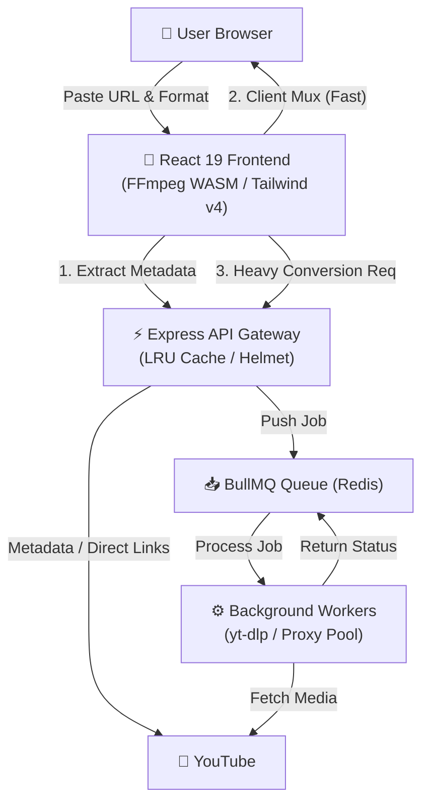

# StreamFetch

<div align="center">


**High-Performance YouTube Media Extraction & Muxing Engine**


</div>

---

## ⚡ Overview

**StreamFetch** is an ultra-fast, modern web application and backend microservice engineered for high-fidelity YouTube media extraction and conversion (MP3 & MP4). Built with a **tactical industrial dark interface ("The Spruce Engine")**, it combines zero-server-bottleneck client-side FFmpeg WASM muxing with a resilient, proxy-rotating Node.js backend.

### Key Highlights

- **Client-Side Muxing (FFmpeg WASM)**: Offloads video/audio merging to the browser, reducing server bandwidth overhead and eliminating waiting lines for standard streams.
- **Async Queue & Job Monitor (BullMQ + Redis)**: Handles heavy workload conversion requests seamlessly via worker pools and Redis task queues.
- **Anti-Blocking Pipeline**: Integrates `yt-dlp` with Webshare proxies, Oracle Cloud proxy routing, and local Tor proxy support for unblocked YouTube metadata retrieval.
- **The Spruce Engine Design**: Custom-crafted, accessible dark teal (`#121917`) and terracotta crimson (`#d65a31`) aesthetic with high-contrast typography (Poppins & JetBrains Mono).

---

## 🏗️ Architecture



---

## 📁 Repository Structure

```text
StreamFetch/
├── client/                      # React 19 + Vite Frontend Workstation
│   ├── src/                     # UI components, FFmpeg WASM hooks, theme tokens
│   ├── package.json             # Dependencies (@ffmpeg/ffmpeg, react 19, tailwind 4)
│   └── vite.config.js           # Vite server & build configuration
│
├── server/                      # Node.js Express API & Microservice
│   ├── src/                     # Controllers, routes, token validators, LRU cache
│   ├── workers/                 # BullMQ workers for async media processing
│   ├── config/                  # Worker pool & proxy configurations
│   ├── api_guide.md             # Complete REST API documentation
│   ├── yt2mp3_postman_collection.json # Postman collection for testing
│   ├── Dockerfile               # Server container definition
│   ├── docker-compose.yml       # Full stack Docker orchestration (Redis + API)
│   └── package.json             # Backend dependencies (bullmq, express, ioredis)
│
├── DESIGN.md                    # Design tokens & Spruce Engine specifications
├── PRODUCT.md                   # Product vision, brand personality & accessibility
└── README.md                    # Root project documentation
```

---

## 🛠️ Tech Stack

### Frontend (`/client`)
- **Framework**: [React 19](https://react.dev/) + [Vite 8](https://vitejs.dev/)
- **Styling**: [Tailwind CSS v4](https://tailwindcss.com/) + Custom CSS Design System
- **In-Browser Processing**: [`@ffmpeg/ffmpeg`](https://ffmpegwasm.netlify.app/) (WASM)
- **HTTP Client**: Axios

### Backend (`/server`)
- **Runtime**: Node.js (ES Modules, Node >= 18)
- **Framework**: Express.js with Helmet security headers & Compression middleware
- **Extraction Engine**: [`yt-dlp`](https://github.com/yt-dlp/yt-dlp)
- **Queue & Storage**: [BullMQ](https://docs.bullmq.io/) + [Redis](https://redis.io/) (`ioredis`)
- **Process Management**: PM2 / Docker

---

## 🚀 Quick Start (Local Development)

### Prerequisites

Ensure the following tools are installed on your machine:
- **Node.js**: `v18.x` or higher
- **Redis Server**: Running locally at `redis://localhost:6379` (or via Docker)
- **yt-dlp**: Downloaded and available in system `PATH` (or configured in `YT_DLP_PATH`)

---

### 1. Clone Repository

```bash
git clone https://github.com/your-username/StreamFetch.git
cd StreamFetch
```

---

### 2. Configure & Run Backend Server

```bash
# Navigate to server directory
cd server

# Install dependencies
npm install

# Copy environment variables template
cp .env.example .env

# Start Redis container (if using Docker)
docker run -d --name streamfetch-redis -p 6379:6379 redis:alpine

# Start development server (Nodemon)
npm run dev
```

The server runs at **`http://localhost:3000`**.

---

### 3. Configure & Run Frontend Client

Open a new terminal window:

```bash
# Navigate to client directory
cd client

# Install dependencies
npm install

# Start Vite dev server
npm run dev
```

The client runs at **`http://localhost:5173`**.

---

## 🔑 Environment Variables Reference

### Backend (`server/.env`)

| Variable | Default Value | Description |
| :--- | :--- | :--- |
| `NODE_ENV` | `development` | Environment mode (`development` / `production`) |
| `PORT` | `3000` | Backend API port |
| `REDIS_URL` | `redis://localhost:6379` | Redis connection URL |
| `MAX_WORKERS` | `4` | Maximum parallel `yt-dlp` extraction processes |
| `EXTRACTION_TIMEOUT` | `25000` | Job timeout limit in milliseconds |
| `YT_DLP_PATH` | `yt-dlp` | Path to `yt-dlp` executable binary |
| `WEBSHARE_PROXIES` | *Optional* | Comma-separated Webshare HTTP/SOCKS5 proxies |
| `ORACLE_PROXIES` | *Optional* | Comma-separated Oracle Cloud proxy endpoints |
| `USE_TOR` | `false` | Enable local SOCKS5 Tor proxy (`localhost:9050`) |
| `ADMIN_API_KEY` | `your_key` | Secret key for system status endpoints |

---

## 📡 API Summary

For full request/response schemas, refer to [`server/api_guide.md`](file:///c:/Users/KIIT/Documents/Apurb%28don%27t%20delete%20this%29/Project2026/StreamFetch/server/api_guide.md).

| Method | Endpoint | Description |
| :--- | :--- | :--- |
| `GET` | `/health` | Server & Redis status check |
| `GET` | `/api/extract?url=<URL>` | Extract video formats & direct stream URLs |
| `POST` | `/api/convert` | Queue heavy audio/video conversion job |
| `GET` | `/api/job/:id/status` | Monitor conversion job status & download link |

---

## 🐳 Docker Deployment

To launch both Redis and the API server in isolated containers:

```bash
cd server
docker-compose up -d --build
```

To stop containers:

```bash
docker-compose down
```

---

## 🎨 Design System: "The Spruce Engine"

StreamFetch features an asymmetric, tactical industrial layout designed for functional clarity:

- **Terracotta Crimson** (`#d65a31`): Action triggers, primary CTA buttons.
- **Deep Spruce Gray** (`#121917`): Dark mode canvas background.
- **Spruce Slate** (`#1b2623`): Input surfaces and card panels.
- **Warm Linen** (`#f7f5f0`): Readable typography.

See [`DESIGN.md`](file:///c:/Users/KIIT/Documents/Apurb%28don%27t%20delete%20this%29/Project2026/StreamFetch/DESIGN.md) and [`PRODUCT.md`](file:///c:/Users/KIIT/Documents/Apurb%28don%27t%20delete%20this%29/Project2026/StreamFetch/PRODUCT.md) for full specifications.

---

## 📄 Authors & License

- **Authors**: Apurb
- **License**: Unlicensed / All Rights Reserved
