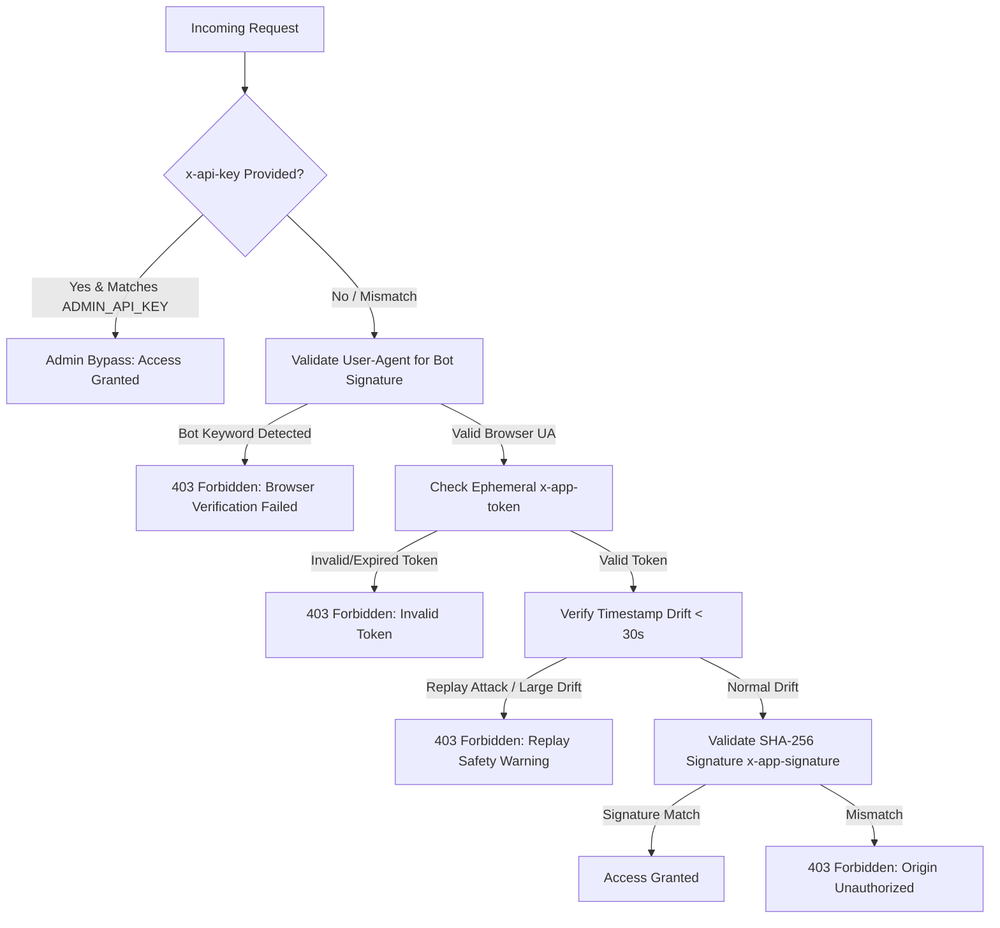

# 🎵 yt2mp3 REST API & Postman Integration Guide

This guide covers the endpoints exposed by the **YouTube Link Extractor REST API**, explains the backend security architecture, and outlines how to test and invoke these endpoints using **Postman** (either via automated signature generation or by using the developer/admin bypass).

---

## 🛡️ API Security Architecture

The backend implements a high-security defense-in-depth framework to block automated scraping and replay attacks without requiring standard user login credentials. It operates on two authorization pathways:



### 1. The Client Security Flow
This flow is simulated by web frontends to sign requests dynamically. It requires:
1. **Sanity Header Checking**: The server rejects user-agents containing scraper/bot indicators (`postman`, `curl`, `python`, `axios`, etc.).
2. **Ephemeral Handshake Token (`x-app-token`)**: A short-lived, cryptographically signed token generated via `GET /api/handshake`.
3. **Replay Protection Timestamp (`x-app-timestamp`)**: The system rejects requests where the difference between server time and header timestamp exceeds **30 seconds**.
4. **Dynamic HMAC/Hash Signature (`x-app-signature`)**: Calculated as:
   $$\text{Signature} = \text{SHA256}(\text{x-app-token} + \text{x-app-timestamp} + \text{body.url} + \text{clientSecretFormula})$$
   *Note: If a route body has no `url` parameter (like `/api/extract/batch`), the `url` part evaluates to an empty string `""`.*

### 2. The Admin/Developer Bypass (Postman Friendly)
If the header `x-api-key` is supplied and matches the `ADMIN_API_KEY` defined in the server `.env` file (`my_secure_admin_api_key`), the backend **completely bypasses** all handshake, timestamp, and signature validation checks. This allows for direct, hassle-free REST testing.

---

## 📇 Endpoint Catalogue

All routes are mounted under the `/api` prefix. The base URL for development is `http://localhost:3000`.

### 1. `GET /api/handshake`
Generates a dynamic short-lived app token to sign subsequent client requests.

* **Authorization**: None (Subject to browser spoofing check).
* **Important Header**:
  * `User-Agent`: Must mimic a standard browser (e.g. `Mozilla/5.0...`). If Postman's default User-Agent is sent, the server will block it.
* **Sample Response (200 OK)**:
  ```json
  {
    "success": true,
    "token": "a1f28b...174829374.174829464.d8f2b7a9...",
    "expiresInMs": 900000
  }
  ```

---

### 2. `POST /api/extract`
Extracts direct high-speed audio/video streaming URLs for a single YouTube link.

* **Authorization**: Client Security Headers OR Admin Key Bypass.
* **Request Body (JSON)**:
  ```json
  {
    "url": "https://www.youtube.com/watch?v=dQw4w9WgXcQ",
    "quality": "best"
  }
  ```
  > [!NOTE]
  > Supported resolutions/qualities: `360`, `480`, `720`, `1080`, `1440`, `2160`, or `best`.
* **Sample Response (200 OK)**:
  ```json
  {
    "success": true,
    "message": "Video links extracted successfully",
    "cached": false,
    "data": {
      "id": "dQw4w9WgXcQ",
      "title": "Rick Astley - Never Gonna Give You Up",
      "duration": 212,
      "viewCount": 1520394812,
      "formats": [ ... ]
    }
  }
  ```

---

### 3. `POST /api/extract/audio`
Extracts only the direct streaming/download URLs for the audio tracks of a single YouTube link (optimized for MP3/M4A converting).

* **Authorization**: Client Security Headers OR Admin Key Bypass.
* **Request Body (JSON)**:
  ```json
  {
    "url": "https://www.youtube.com/watch?v=dQw4w9WgXcQ"
  }
  ```
* **Sample Response (200 OK)**:
  ```json
  {
    "success": true,
    "message": "Audio links extracted successfully",
    "cached": false,
    "data": {
      "id": "dQw4w9WgXcQ",
      "title": "Rick Astley - Never Gonna Give You Up",
      "duration": 212,
      "thumbnail": "https://i.ytimg.com/vi/dQw4w9WgXcQ/maxresdefault.jpg",
      "uploader": "Rick Astley",
      "uploadDate": "20091025",
      "viewCount": 1520394812,
      "likeCount": 17820492,
      "audioUrl": "https://rr4---sn-5uaezn76.googlevideo.com/videoplayback?...",
      "audioBitrate": 128,
      "ext": "m4a",
      "filesize": 3450289,
      "formats": [
        {
          "formatId": "140",
          "ext": "m4a",
          "bitrate": 128,
          "filesize": 3450289,
          "url": "https://rr4---sn-5uaezn76.googlevideo.com/videoplayback?..."
        },
        {
          "formatId": "251",
          "ext": "webm",
          "bitrate": 142,
          "filesize": 3720391,
          "url": "https://rr4---sn-5uaezn76.googlevideo.com/videoplayback?..."
        }
      ]
    }
  }
  ```

---

### 4. `POST /api/extract/batch`
Extracts streaming metadata for multiple YouTube videos concurrently.

* **Authorization**: Client Security Headers OR Admin Key Bypass.
* **Request Body (JSON)**:
  ```json
  {
    "urls": [
      "https://www.youtube.com/watch?v=dQw4w9WgXcQ",
      "https://www.youtube.com/watch?v=9bZkp7q19f0"
    ],
    "quality": "best"
  }
  ```
  > [!IMPORTANT]
  > The concurrency pool restricts requests to between **1 and 10** URLs per batch execution.
* **Sample Response (200 OK)**:
  ```json
  {
    "success": true,
    "batchSize": 2,
    "results": [
      { "url": "...", "success": true, "data": { ... } },
      { "url": "...", "success": true, "data": { ... } }
    ]
  }
  ```

---

### 5. `POST /api/formats`
Returns a streamlined layout of available formats, sizes, and file types without standard extraction payloads.

* **Authorization**: Client Security Headers OR Admin Key Bypass.
* **Request Body (JSON)**:
  ```json
  {
    "url": "https://www.youtube.com/watch?v=dQw4w9WgXcQ"
  }
  ```
* **Sample Response (200 OK)**:
  ```json
  {
    "success": true,
    "cached": true,
    "formats": {
      "audio": [ ... ],
      "video": [ ... ]
    }
  }
  ```

---

### 6. `GET /api/extract/status/:jobId`
Polls the extraction status of a background job. On successful completion, returns the extracted formats/metadata.

* **Authorization**: None (no signing required for polling status check).
* **URL Parameters**:
  * `jobId`: The unique BullMQ task ID returned by the queued POST requests.
* **Query Parameters (Optional)**:
  * `type`:
    * `audio`: Automatically filters formats to return the optimized audio payload structure.
    * `formats`: Automatically strips formats to return the streamlined formats layout.
* **Sample Response (200 OK - Processing)**:
  ```json
  {
    "success": true,
    "jobId": "285",
    "status": "active",
    "progress": 10
  }
  ```
* **Sample Response (200 OK - Completed)**:
  ```json
  {
    "success": true,
    "jobId": "285",
    "status": "completed",
    "progress": 100,
    "data": {
      "id": "dQw4w9WgXcQ",
      "title": "Rick Astley - Never Gonna Give You Up",
      "duration": 212,
      "formats": [ ... ]
    }
  }
  ```

---

### 7. `GET /api/stats`
Secure backend diagnostics dashboard (RAM heap, active extraction threads, pending job queue status, cache hit rates, and BullMQ queue sizes).

* **Authorization**: Requires `x-api-key: my_secure_admin_api_key`.
* **Sample Response (200 OK)**:
  ```json
  {
    "success": true,
    "timestamp": 1748293740922,
    "uptimeSeconds": 157.34,
    "memoryHeapUsage": { "rss": 48291024, "heapTotal": 31920192, "heapUsed": 24902194 },
    "cacheMetrics": { "keys": 12, "hits": 45, "misses": 3 },
    "activeWorkersCount": 4,
    "activeJobsPending": 0,
    "queuedJobsWaiting": 0,
    "bullmqQueueStats": {
      "active": 0,
      "completed": 24,
      "failed": 0,
      "delayed": 0,
      "waiting": 0,
      "paused": 0
    }
  }
  ```

---

### 8. `GET /api/proxy`
Optimized streaming proxy using native fetch to resolve CORS blockages on YouTube streams in the frontend. It streams video data chunks sequentially.

* **Authorization**: None required.
* **Query Parameters**:
  * `url`: URL-encoded direct video/audio stream URL to proxy.
* **Sample Request**:
  `GET http://localhost:3000/api/proxy?url=https%3A%2F%2Frr4---sn-5uaezn76.googlevideo.com%2Fvideoplayback%3F...`

---

### 9. `GET /`
Verifies that the primary Express server is online and responding.

* **Authorization**: None required.
* **Sample Response (200 OK)**:
  ```json
  {
    "success": true,
    "message": "YouTube Link Extractor REST API is online."
  }
  ```

---

### 10. `GET /health`
Returns system status telemetry including Redis connectivity state.

* **Authorization**: None required.
* **Sample Response (200 OK)**:
  ```json
  {
    "status": "ok",
    "timestamp": 1748293740922,
    "uptimeSeconds": 157.34,
    "workerId": "primary",
    "clusterPid": 29480,
    "environment": "development",
    "connections": {
      "redis": "connected"
    }
  }
  ```

---

## 🚀 How to Invoke in Postman

We have generated a fully configured, 1-click importable Postman collection file in the workspace at:
👉 **[yt2mp3_postman_collection.json](file:///c:/Users/KIIT/Documents/Apurb%28don%27t%20delete%20this%29/Project2026/yt2mp3/server/yt2mp3_postman_collection.json)**

### 📥 Setup & Import
1. Open **Postman**.
2. Click **Import** in the top-left corner.
3. Select and drag-and-drop the `yt2mp3_postman_collection.json` file.
4. Click **Import** to load the collection.
5. All endpoints are now available under the `yt2mp3 API Collection` folder.

---

### 🔑 Method A: The Quick Developer Bypass (Recommended for Testing)
To completely bypass token handshake and cryptographic signature generation:
1. Open any request inside the collection (e.g. `Extract Links (Single Video)`).
2. Go to the **Headers** tab.
3. Find the pre-configured `x-api-key` header (value: `{{adminApiKey}}`).
4. Simply **check/enable** the checkbox next to it!
5. Send the request. It will immediately complete successfully!

---

### 🔐 Method B: Testing the Full Client Security Flow (Fully Automated)
If you want to test the full client-side token validation and signature check, the imported Postman collection has a **Pre-request Script** already built at the collection folder level. 

#### How the Script Works Automatically:
1. When you run `Extract Links`, `Formats`, or `Batch`, the script fires first.
2. It checks if `x-api-key` is present in headers. If present, it skips signing.
3. It checks for a valid, unexpired token in Postman Global Variables.
4. If missing or expired, it runs a background `pm.sendRequest` call to `/api/handshake`, spoofing the `User-Agent` to bypass the scraper block, and caches the new token.
5. It reads the outgoing request body, grabs the `url` parameter, and calculates the SHA-256 signature using `CryptoJS`:
   $$\text{Hash} = \text{SHA256}(\text{Token} + \text{Timestamp} + \text{URL} + \text{clientSecretFormula})$$
6. It dynamically injects the headers:
   * `x-app-token`
   * `x-app-timestamp`
   * `x-app-signature`
7. The request proceeds to the server with valid, mathematically synchronized signatures.

To execute this, **just make sure the `x-api-key` header is unchecked/removed**, and hit **Send**! The console output will log:
```text
[Postman Pre-request] Token expired or missing. Fetching new handshake token...
[Postman Pre-request] Fresh token successfully acquired: <token_details>
[Postman Pre-request] Applied signature: <sha256_hash>
```

---

## 🛠️ Postman Collection Variables
You can customize configuration variables by clicking on the `yt2mp3 API Collection` root folder, selecting the **Variables** tab, and altering their values:

| Variable | Default Value | Description |
| :--- | :--- | :--- |
| `baseUrl` | `http://localhost:3000` | The host port where your Node server runs. |
| `adminApiKey` | `my_secure_admin_api_key` | Bypasses signing and authenticates `/api/stats`. |
| `clientSecretFormula` | `yt2mp3_dynamic_secure_formula_salt_2026` | Secret formula key used to sign requests. |
